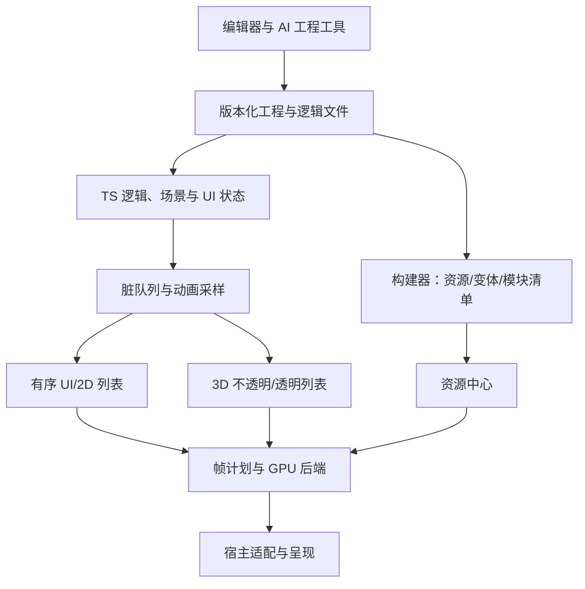

# 技术架构

[English](../../en/docs/technical-architecture.md) | 简体中文

更新：2026-10-08，知识库 0.7.0。本文是候选架构；此前已运行独立合同模型与本地浏览器图形研究程序，完整引擎、生产宿主、性能及迁移尚未验收，具体技术选型尚未批准。D001—D016 均为 proposed，H001—H008 均为 untested。已确认需求见[需求台账](../registry/需求.json)，候选取舍见[决策台账](../registry/决策.json)。

[知识库首页](../README.md) · [技术白皮书](技术白皮书.md) · [产品需求说明书](产品需求说明书.md) · [工程规划](工程规划.md) · [第二轮验证记录](第二轮验证记录.md) · [第二轮审计](第二轮审计.md) · [第一轮历史验证](技术验证记录.md) · [第一轮研究核查](第一轮研究核查.md)

## 设计起点

面向主要靠 AI 制作游戏的新创作者，提供复杂 UI 的 2D 与轻量 3D 混合创作（R002），把渲染与运行时作为核心（R003），支持场景、角色、VFX、UI、2D 骨骼和序列帧（R004）。轻量 3D 的内容规模、目标设备与宿主范围仍待确定；加载、帧时、内存和功耗优势是待验证目标（R005），不能作为现有能力描述。

候选主线是“统一创作数据与资源契约，按负载组织执行，共享设备和帧调度”。易用的 TS 场景/组件 API 与紧凑执行数据分层；避免把复杂 UI 强行转换成 3D 对象，也避免发展两套互不兼容的引擎。产品边界见[产品组成](产品组成.md)。

R011 要求逐步研究、推敲、验证并自审设计。本轮 V008 形成白皮书、PRD 和工程规划0.6候选包；V001 研究部分进入 in_progress，V002已有局部headless核心，V003—V006 产品实现仍未开始。合同模型和局部像素实验只支持各自实际执行的边界，尚未覆盖完整 UI、骨骼、混合资产、实际 JS/WASM/C++ 桥接或宿主设备矩阵；模型审计的漏洞与修复复验以[第二轮验证记录](第二轮验证记录.md)为准，不从研究程序通过推导产品架构已成立。

## 数据权威与接口合同

| 层 | 权威与约束 |
|---|---|
| 创作工程 | 工程、场景、组件、材质、动画 schema 与逻辑文件是持久化权威；保存带版本，稳定对象 ID 支持差异、迁移与来源追踪。 |
| 运行状态 | TS 逻辑层拥有游戏状态、场景变更、动画时钟与事件；加载工程形成初始状态，运行中的临时状态不反向静默修改工程。 |
| 执行镜像 | C++/WASM/GPU 仅持有可重建投影；布局、命中、边界查询优先在所属层计算或异步回传，避免双向逐属性同步。 |
| 构建产物 | 内容哈希、工具版本、目标能力 profile 与依赖清单决定派生资源；缓存不是权威，丢失后可重建。 |
| 宿主 | 适配器提供 surface、输入/IME、时钟与呈现、音频、文件/网络/存储、生命周期和权限；能力探测与错误分类不得伪装成全部浏览器 API。 |

桥接包需含协议版本、对象 ID/代际、帧序号、资源就绪依赖及缓冲所有权。创建、更新、销毁在确定帧边界应用；销毁后的旧异步回调按代际丢弃。队列设容量与背压，禁止无限积压；允许合并可覆盖的状态更新，必须保留事件顺序。协议不兼容、序号缺口或上下文丢失时停止提交，按已确认快照重建镜像并重新绑定资源，不能以忽略命令恢复。

资源中心分别跟踪下载/解码产物、CPU 数据和 GPU 句柄，使用显式场景租约与依赖所有权。卸载先取消任务、解除引用，再在 GPU 使用完成后释放；异步换图保持旧资源至新资源就绪。加载失败有超时、有限重试、占位或明确阻断；OOM 先释放可重建缓存和降低可选质量，仍无法满足预算则返回可诊断错误。后台恢复重置时钟基线，避免补跑无限帧；设备丢失可重建图形状态，不应重发已消费的游戏事件。

## AI 工具与旧工程约束

R006 的 AI 工程工具通过有版本的工程命令、schema 和开发诊断工作，不进入每帧渲染循环。修改先校验依赖和能力要求，记录来源与差异，生成可预览结果；事务失败恢复原工程。自然语言建议不能越过工程验证直接变成运行时权威。

R008 已是首个完整发布目标的正式交付要求：[旧工程一键 AI 迁移](旧工程迁移.md)必须从核心接口设计纳入。V006 最终依赖 V001—V005。显示顺序、坐标/锚点、事件、计时、遮罩/滤镜、EUI 和动画语义需要映射；兼容模块按依赖裁剪。旧工程固定为视觉、行为、资源和平台回归样本，报告自动转换覆盖率与人工介入，不能以“导入成功”代替“移植后运行正确”。

历史 Runtime 静态审阅观察到二进制命令桥接、原生保留树、相邻纹理合批和脏缓存，可作为机制参考；未证明当前可构建、全平台完整或性能领先。历史网络代码还观察到证书校验关闭，复用网络模块前必须重新核实并修复安全默认值。

## 选型边界

TS公共接口、可选Rust/C++计算/执行模块与WASM/原生部署是候选，是否下沉由端到端瓶颈决定。[Cocos 的历史 JSB 优化记录](https://docs.cocos.com/creator/3.8/manual/en/advanced-topics/jsb-optimizations.html)说明原生化收益曾被新增桥接抵消；这不代表其当前版本性能落后。

竞品存在兼容成本，也持续重构：[Cocos 3.8 的管线迁移](https://docs.cocos.com/creator/3.8/manual/zh/render-pipeline/overview.html)、[LayaAir 3.3.0 重写记录](https://github.com/layabox/LayaAir/releases/tag/v3.3.0)、[Godot 3→4 升级说明](https://docs.godotengine.org/en/4.7/tutorials/migrating/upgrading_to_godot_4.html)。本轮官方核查支持若干机制与版本，但保留 Laya 3.3/3.4 的来源日期冲突，IDE 与旧官网日期未重验，详见[第一轮研究核查](第一轮研究核查.md)。各引擎的迁移和重构记录保留具体版本边界；白鹭的效率目标由持续验证的作品结果判断，长期优势仍需版本回归验证。首批宿主、团队、工期和数字性能预算尚未确认；后续见[渲染引擎与运行时](渲染引擎与运行时.md)、[核心优势与验证](核心优势与验证.md)和[交付计划](交付计划.md)。

第二轮已部分验证独立事件流、逐租约异步资源、嵌套布局/命中和批次共享状态，并实际运行程序生成的WebGL混合场景。它们没有覆盖完整资产、文字/骨骼语义或目标设备预算；当前合同细化与下一步门槛以[技术白皮书](技术白皮书.md)、[工程规划](工程规划.md)及[第二轮验证记录](第二轮验证记录.md)为准。

## 已执行成熟实现基线

R012已确认开源实现优先原则。按[采用方案](开源参考实现与采用方案.md)以成熟3D renderer/glTF/动画、Canvas文字和压缩纹理路径推进可替换参考链，统一白鹭帧、状态与资源接口；不重复研究已有基础算法。首条r186真实glTF参考链已执行，当前17/17检查通过；[第三轮集成](第三轮集成记录.md)和[审计](第三轮审计.md)记录资产、共享所有权、文字/图形交接、恢复及错误路径。已有研究代码，尚未完成完整复杂UI/2D骨骼/角色、CJK/IME、宿主或收益验收；D/H/完整产品状态没有越级。

## 本轮后端与原生选型补充

[图形后端编译与原生Runtime选型](图形后端编译与原生Runtime选型.md)补充WebGPU/WebGL/Canvas职责、TS7工具链、Rust/C++、VM与原生图形库，以及未来桌面和GPUAI扩展。只新增来源研究与候选设计，未安装/执行这些候选或增加第三轮17项的覆盖；D013–D015仍proposed，H008仍untested。

## 核心实现来源

按R015及[独立实现与第三方依赖规范](独立实现与第三方依赖规范.md)独立编写白鹭核心。标准机制和成熟源码用于理解，公共库保持显式依赖身份；此前第三方参考链保留研究范围，不视为自主内核。

## 工程结构与公共代码合同

R016确认现代工程与白鹭风格要求。D016的[工程结构](工程技术架构与项目结构.md)、[API与命名](公共API设计与命名规范.md)、[代码规范与门禁](代码规范与质量门禁.md)细化包依赖、公共入口、Scope/租约、事件、原生边界、Agent事务与质量检查。名称与API均为候选；[首段自主核心](核心框架实现记录.md)已严格编译并验证headless子集与包边界，完整API、GPU/平台、CI及完整迁移尚未验收。
