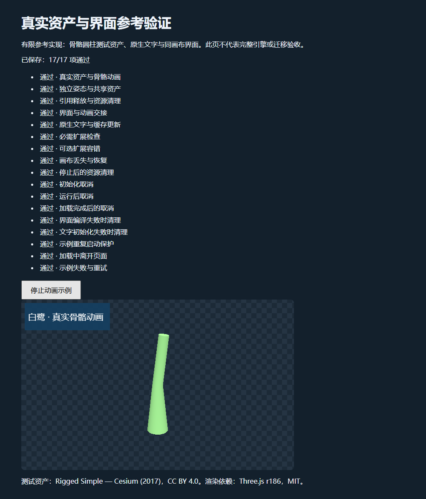

# 第三轮真实资产参考链集成记录

[English](../../en/docs/round-3-integration-record.md) | 简体中文

更新：2026-10-08，知识库0.5.0。首条参考链已实际复用Three r186的glTF导入、骨架克隆、动画采样和WebGL renderer，在同一context内合成Canvas文字UI。最终本地桌面主回归17项执行、17项通过、0失败，页面错误与console诊断均为0。这支持继续扩展白鹭适配工程，尚不证明完整产品或性能优势。

[首页](../README.md) · [第三轮计划](第三轮集成计划.md) · [独立审计](第三轮审计.md) · [工程规划](工程规划.md) · [可运行入口](../experiments/asset-reference-probe/README.md) · [原始主报告](../../evidence/asset-reference-probe-results.json)

## 固定组件与真实资产

Three执行版本为r186，代码commit `9b4a2ac29c63ccb43fd51c5661f2f873ac2c39b8`，MIT。上一轮r180属于历史源码研究，原始证据保留，不与当前执行拼成同一版本。模块直接在本机加载，没有CDN或安装脚本；[来源清单](../../experiments/asset-reference-probe/sources.json)保留9文件的固定URL、Git blob、SHA256和大小，[静态依赖核查](../../evidence/asset-reference-dependencies.json)确认5个ESM模块的已检测imports闭包。

资产为Khronos glTF-Sample-Assets固定commit `edc7c9e67c639d230715049ee31f9a96a6babbbe`的RiggedSimple embedded版本。归属Cesium2017，CC-BY-4.0；许可不冒称CC0。它是加权蒙皮圆柱，有1skin、2joint、1clip、160顶点、188三角形和25,435 bytes JSON，内嵌buffer11,136 bytes，无图像、纹理或压缩依赖。这足以验证真实导入与实例语义，不能代表完整人物、美术质量或角色控制体系。[第三方声明](../experiments/asset-reference-probe/THIRD_PARTY_NOTICES.md)与原始许可随资产保留。

## 白鹭适配与已执行行为

一个调用方拥有帧循环，固定时间renderAt也是示例的唯一绘制入口。Three承担成熟3D功能，独立UI pass拥有自己的program、VAO、Canvas纹理和显式GL状态；回到Three前resetState使缓存重新与实际状态同步。共享context并不等于共享两个执行器的缓存。

共享bundle持有geometry/material、原始场景与clip；实例各自持有骨架pose与Mixer。第一次释放不能结束仍有引用的bundle，最后引用才清空其所有权根。contextlost时只撤销旧GPU分配和旧监听，保留CPU资源；恢复后由成熟renderer重新上传。初始化取消、失败、示例待启动与页面退出同样属于所有权边界。

Canvas用原生measureText/fillText整串处理文字，保留业务原文，包括组合字符、emoji序列及空格。当前单条文字缓存按原文、样式、分辨率与显式fontEpoch失效；图形恢复按保留文本/style再生成纹理。当前使用系统字体，检查调用和有限像素，不认定具体字体身份、字形覆盖、中文换行、IME或速度。

| 主回归场景 | 预先规定的行为 | 最终结果 |
| --- | --- | --- |
| 真实资产与动画 | 实际蒙皮网格有2骨骼，0与0.7秒的姿态及非空像素改变 | 通过 |
| 共享几何与独立姿态 | 共享geometry/material，骨架、骨节点及Mixer独立 | 通过 |
| 最后引用释放 | 先释放一个后另一个仍能画，最后共享资源处置且owner根清空 | 通过 |
| 3D与UI状态交接 | 12次交接，3D区域与无UI参考相同，文字非空且无GL错误 | 通过 |
| Canvas原文与缓存代次 | 调用原生测量绘制且原文不变，相同键复用，代次/样式/分辨率失效 | 通过 |
| 必需扩展拒绝 | 未支持的必需扩展在loader成功前拒绝 | 通过 |
| 可选扩展忽略 | 忽略未知可选扩展后真实资产仍显示 | 通过 |
| 实际图形上下文恢复 | 实际lost时拒绝绘制，restore后3D和文字非空且固定帧相同，清理无GL错误 | 通过 |
| 销毁后拒绝与清理 | 销毁后拒绝操作、所有权根清空且不被恢复事件复活 | 通过 |
| 初始化中取消 | 初始化中取消明确拒绝，不返回ready实例 | 通过 |
| 运行后取消 | 取消已就绪owner后释放并拒绝继续渲染 | 通过 |
| 真实解析结果晚到后取消 | 真实解析后取消，处置已解析资源且不再分配WebGL | 通过 |
| 着色器初始化失败清理 | 保留受控着色器错误，清理已解析资源、renderer监听及已分配UI句柄 | 通过 |
| 文字初始化失败清理 | 保留受控文字错误，清理已解析资源、renderer监听及部分UI句柄 | 通过 |
| 示例重复启动与停止重启 | 延迟真实加载中重复启动保持单owner和单帧循环，停止与重启正确 | 通过 |
| 示例加载期间离开 | 真实加载中离开不接受迟到的活动owner或帧循环 | 通过 |
| 示例启动失败与重试状态 | 启动错误被处理，清理资源和帧循环，按钮可重试 | 通过 |

必需扩展检查是白鹭参考profile策略：未支持required名称前置拒绝，可选未知扩展可以忽略。实际资产没有required扩展，当前allowlist不等于逐扩展产品验收；Draco、KTX2/Basis和meshopt解码均未配置或执行。

## 失败如何改变实现与判定

测试先行的干净红版11项均因行为未实现而失败；另保留初次favicon404噪音，后续行为红版没有模块/语法/404错误。首个实现虽报11/11，却有7条恢复后旧GPU句柄删除诊断。补清理断言后实际10/11，GL1282暴露此前判定缺口；修正geometry与骨骼texture的旧GPU dispose监听后恢复及清理通过。这只限固定r186参考链，不是整个上游引擎的通用缺陷结论。

四种故意错误分别移除renderer reset、提前结束共享bundle、忽略required拒绝、遗漏UI恢复。原12项测试各拦截1项：状态交接变异由GL1282拦截，提前释放由dispose断言拦截，required由错误接受拦截，UI恢复由文字像素空白/不同拦截；不能把GL错误写成3D像素已经不同。变异仅用于检查测试能否发现这些错误，不增加主回归数量。

独立审阅进一步发现示例重复启动/加载中离开可产生迟到owner，以及UI初始化失败不能完整撤销已获取资源。新增失败回归、修正与复跑另有独立报告；最终范围以本页主表为准。失败、修正前源码和每次实际run报告保留，[审计记录](第三轮审计.md)说明独立复核与最终集成复跑的分工。

同一示例首帧前停止再重启，还暴露UI留下的UNPACK_PREMULTIPLY_ALPHA_WEBGL=true进入新renderer构造，触发empty3D texture上传的GL1282与两条警告。常规首帧后的重启没有复现，因为首帧改变了该状态；保留这次正常通过记录，再用受控的真实RAF交付时序重现窗口。适配层在取得可复用context后、构造renderer前明确设定unpack基线；此回归并入原示例案例，没有额外累计用例。

## 包体与产品取舍

[文件估算](../../evidence/asset-reference-file-footprint.json)独立计算未裁剪五JS模块加embedded资产共2,313,137 bytes；分文件gzip9合计461,988 bytes，Brotli11合计350,491 bytes。没有minify/tree-shake，排除白鹭适配、HTML、工具元数据与许可，未测真实网络或发行包。不能把该数值当底包、首次可玩或相对竞品优势。

因此生产构建按能力拆分：2D配置应避免携带3D模块；3D路径补目标裁剪和依赖清单，按真实宿主记录首包、分包、decoder、字体和首次交互。当前选择Three的理由是降低集成未知并保持替换边界，没有同内容同画质的跨引擎速度或包体排名。

## 复现与保留边界

Node和Playwright来自已有运行环境。进入参考链目录后运行以下入口；Playwright参数由环境提供。历史源码只存authored模块，复现历史版需按README暂时切换对应快照，同一固定vendor/assets不变，结束后恢复当前源码。

```powershell
node ./run-headless.cjs '<Playwright package root>' verification
node ./server.mjs
```

测试服务器仅绑定127.0.0.1，固定白名单，报告写入需临时随机token，目标路径及请求大小有界。原始报告记录浏览器154.0.4258.62、640×400、DPR1、antialias=false、preserveDrawingBuffer=true及来源hash；该绘图配置用于读回验证，不作为生产默认。最终集成复跑执行ID为`d642177d-b007-4c0e-80a2-0f85e150d0c0`。重复运行、历史副本、审计和变异均不累加成主案例。



下一步是2D旧骨骼语义金样、完整3D角色与复杂UI、资源/frame/交互就绪阶段、字体提供者、目标构建裁剪及AI连续编辑。完整2D附件/约束/事件、角色控制、WebGPU场景、真实手机与小游戏/原生宿主、帧时/功耗、文字覆盖/IME、创作者任务与R008完整迁移仍需各自验收。D001–D012仍proposed，H001–H007仍untested；V002/V004只有有限researchProgress，完整V002–V006产品实现及验收状态不变。V006最终依赖V001–V005，并保留继续编辑与真实发布义务。
