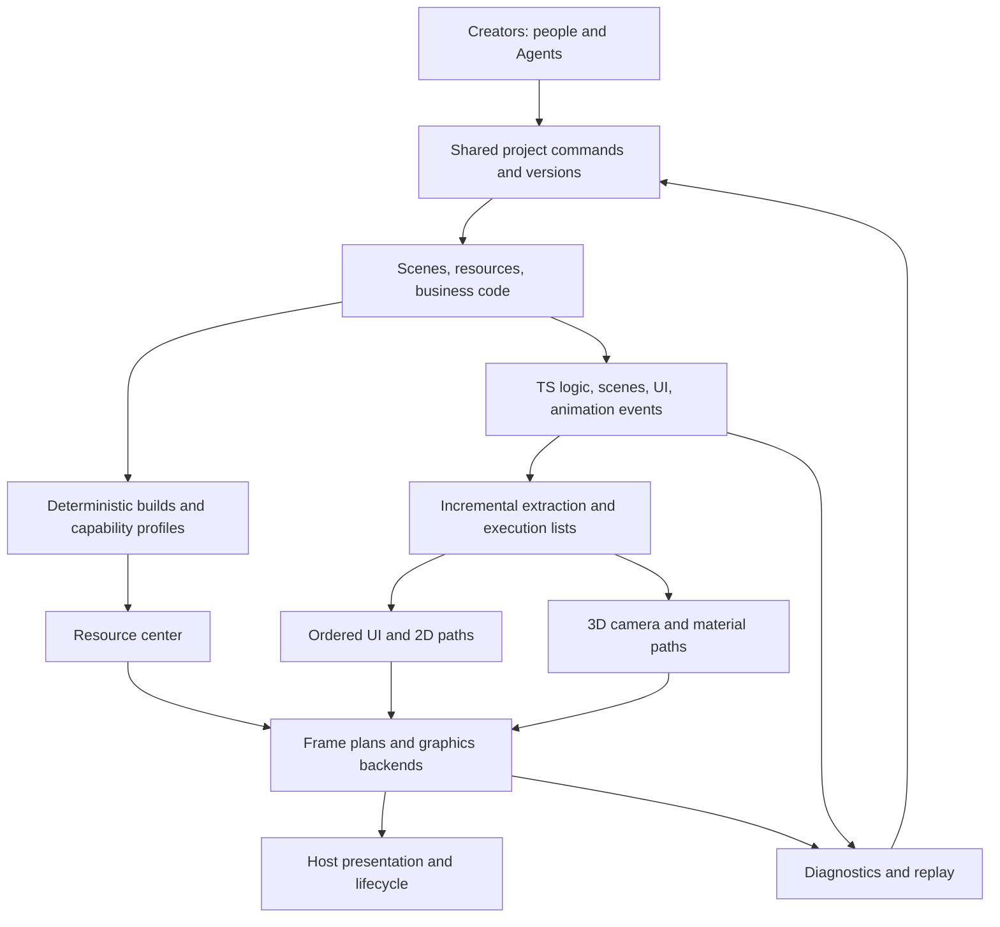

# Technical White Paper

English | [简体中文](技术白皮书.md)

Version: 0.7 candidate draft · Updated: October 8, 2026. This document refines new Egret's technical tradeoffs, contracts, and verification path; specific selections still await verification and decisions. Round three's real-asset reference chain passed 17 adaptation checks and a separate example smoke check, and runnable research code exists; see [round-three integration](第三轮集成记录.en.md). Round two's 64 CPU contract/layout/batch checks (13 events, 25 resources, 18 UI, 8 batches) and 7 local WebGL2 checks, totaling 71, retain their original scope/failure records. Knowledge base 0.7.0 only refined candidate engineering architecture/API/code standards, adding or rerunning no programs at that time. Version 0.8.0 added strict compilation and headless verification of the [first independent core slice](核心框架实现记录.en.md), without rerunning old research programs. Bounded research evidence does not constitute new-engine, complete rendering-prototype, performance, real-host, or legacy-migration acceptance.

[Product requirements](产品需求说明书.en.md) · [Engineering plan](工程规划.en.md) · [Research review](第一轮研究核查.en.md) · [Round-one verification](技术验证记录.en.md) · [Round-one audit](第一轮审计.en.md) · [Round-two verification](第二轮验证记录.en.md) · [Round-two audit](第二轮审计.en.md)

## Design objectives and levels of evidence

Confirmed objectives serve new creators using AI to make games, combining complex 2D UI and lightweight 3D with rendering/runtime at the core, and formally delivering one-click AI migration of old projects. Historical efficiency, interface migration, and tool-integration experience determine research priorities; today's lead still requires measurement. The [requirements register](../registry/需求.json) owns specific requirements.

Use four evidence levels: requirement records establish project objectives; official/static materials describe mechanisms/version scope; independent programs verify actually executed contracts; only complete products and real-device comparisons prove delivery/performance. These levels cannot promote one another. H001–H008 remain `untested`, D001–D016 remain `proposed`; V002 has a local independent headless core, with complete rendering/formal acceptance unfinished. Product implementation for V003–V006 remains `not_started`. The Khronos page cited in round two is an editor's draft reference according to its `editorDraft` identity, not a final approved standard. Specification descriptions are not implementation, performance, or host acceptance.

Round one's 26 architecture-model and 7 local-browser checks remain in the original [technical verification record](技术验证记录.en.md), without being overwritten by round two. Current round-two evidence and explicit boundaries follow. The 71 registered cases include boundary characterization and counterexamples for wrong strategies; they are not product acceptance items or exhaustive state-space coverage.

| Research group/current result | Actual coverage | Claims this cannot establish |
| --- | --- | --- |
| [Events 13/13](../evidence/reliable-event-probe-results.json) | In-memory outbox, contiguous consumption watermarks, ACK identity, retransmission/deduplication, backpressure, state-reset counterexamples | Persistent delivery, process-crash recovery, cross-process exactly-once, real audio/network bridging |
| [Resources 25/25](../evidence/async-resource-probe-results.json) | Independent leases, decode/upload states, task/device generations, late callbacks, explicit fences, failed retries | Real decode, driver upload/release, thread safety, real OOM, resource performance |
| [Nested UI 18/18](../evidence/nested-ui-probe-results.json) | Bounded vertical layout, size dependencies, structural editing, rectangular clip/hit tests, external glyph-width fixtures | Complete EUI, real font shaping/IME, arbitrary constraint layout, local-world-update performance |
| [Independent batches 8/8](../evidence/batch-state-probe-results.json) | Ordered adjacent batching, independent consumer reads of texture/pipeline/clip, capacity boundaries | Arbitrary masks, filters, complete materials, GPU performance advantage |
| [Mixed graphics 7/7](../evidence/mixed-scene-probe-results.json) | Local desktop WebGL2 procedural geometry, actual batched pixels, perspective cube, two rigid geometry segments, frame atlas, fixed-frame recovery | Real character/skeletal asset import, complete animation, WebGPU scene backends, phone/mini-game/native hosts, FPS/power advantages |

## Three development paths and candidate direction

| Path | Benefits | Main costs | Judgment at this stage |
| --- | --- | --- | --- |
| TS creation/logic, workload-based rendering, optional WASM/native core | Close to Web development ecosystems, easy AI project operations, on-demand trimming/local replacement | Multi-backend/cross-language contracts still need maintenance; hotspot movement down the stack needs measurement | Retain as candidate prototype direction; local research is not final approval |
| Move all core code to C++ or Rust/WASM first, then add scripting interfaces | Centralized native resource/computation strategies | Initialization, module size, bridging, debugging, host limits may offset computation gains | Comparison for computation hotspots/native routes; not fully adopted for now |
| Integrate a mature rendering kernel, building Egret creation/migration layers on it | Some 3D capability can arrive faster | UI semantics, package size, resource lifecycles, platforms, licenses may be constrained by the foundation | Three renderer/glTF/animation is only the executed reference chain. Implement Egret's independent core separately; prospective production dependencies state public-component attribution/cost separately. |

The candidate direction unifies project/resource semantics, separately organizes UI/2D and 3D execution, and shares necessary devices, resources, and scheduling. Actual bottlenecks drive performance optimization. TS, WASM, or WebGPU names alone create no advantage. [Historical Cocos JSB costs](https://docs.cocos.com/creator/3.8/manual/en/advanced-topics/jsb-optimizations.html) and [Emscripten interoperability documentation](https://emscripten.org/docs/porting/connecting_cpp_and_javascript/Interacting-with-code.html) support careful transfer/lifecycle design, not cross-engine speed rankings.

## Mature implementations as an engineering starting point

R012 requires first understanding mature community principles; R015 requires independently written Egret core code and explicit public-dependency attribution. The first real-asset chain uses Three's mature renderer, GLTFLoader, and AnimationMixer, retaining package-size, state-handoff, UI-composition, lifecycle, and replacement boundaries. Babylon/PlayCanvas provide mechanism/replacement comparisons. Ordinary Web text uses mature Canvas whole-line/run measurement and drawing; high-frequency numbers/fixed short labels use controlled atlases. General glTF/KTX2 libraries can be explicit dependencies. Foundational track/skeletal principles need no reinvention; Egret's animation/resource core independently follows its own specifications.

See [open-source reference implementations and adoption plan](开源参考实现与采用方案.en.md) for pinned commits, specific functions, licenses, fixed issues, and Egret adaptation boundaries. The first reference chain pins Three r186 and has run, passing 17/17 bounded adaptation checks; see [round-three integration](第三轮集成记录.en.md). Historical r180 source research and the current executed version remain separate. Product/device acceptance still confirms cross-host fonts/IME, complete complex-UI/3D combinations, target package size, and benefits.

## Boundary corrections from real-asset integration

Current work reuses mature glTF import, skeleton cloning, animation sampling, and rendering; Egret adapts shared CPU resources, independent instance poses, same-context UI state handoff, and recovery. Actual skinned frames and text UI after recovery are nonempty and byte-for-byte identical at fixed frames; this covers only one 2-joint cylinder. Graphics availability, uploaded resources, and work interactivity must be separate states; context restored cannot substitute for work acceptance.

Recovery-cleanup regression found old GPU allocation listeners still holding old handles. On loss, the adapter revokes GPU allocations while retaining shared CPU resources; the mature renderer reuploads after recovery. CPU bundle ownership ends only after the final instance exits. These lifecycles cannot share one “destroyed” flag. Initialization failure and exit while an example awaits startup must also clean up or reject late ownership; see the [audit](第三轮审计.en.md).

The current untrimmed five JS modules and embedded assets total 2,313,137 bytes. Per-file gzip9 totals 461,988 bytes and Brotli11 350,491 bytes, both local estimates only. The initial 2D profile should avoid 3D modules; 3D needs target-build trimming and host-specific initial-package/first-interaction measurements. The reference chain establishes no small-package or fast-loading advantage.

## Project, logic, and execution state

Persistent projects contain source assets, scenes, rules, and business code; runtime logic owns game state/events; GPU/C++ execution mirrors are rebuildable. Permanent project-object identity is separate from runtime-handle slot/generation, preventing incorrect location after destruction, copying, or asynchronous callbacks. Build caches derive from content/tools/target configurations and may be discarded/rebuilt; they cannot become the only originals.

Public APIs retain clear scene/component/UI expression without requiring creators to understand memory layouts. Compact hotspot data, SoA, object pools, and C++ cores are evaluated beneath the API. Independent trimmable adapters/migration rules carry legacy semantics without forcing every new work to include all historical runtime code.

## Rendering strategies and frame plans

The recommended 3D baseline is mobile forward rendering, first covering unlit, PBR/toon, ambient light, baked and bounded realtime lighting/shadows, with camera culling, LOD, and instancing. Benchmarks define counts, specifications, and physics scope. Forward+, compute particles, and advanced postprocessing enable by capability/content and are not prerequisites for all hosts.

UI/2D skeletal animation obeys display, slot, transparency, and mask order. 3D opaque lists may optimize material/depth order; transparent lists have separate correctness constraints. Screen UI defaults to clear resolution and can composite directly onto the final target; request offscreen resources only for masks, filters, or cross-layer composition. World-space UI, interleaved 2D/3D, color spaces, and blending conventions need explicit definitions; default “UI after 3D” does not handle all scenes.

Small frame graphs describe pass dependencies, resource reads/writes, lifetimes, and load/store, caching plans by scene features/capabilities. Changes trigger rebuilds rather than per-frame interpretation of a large generic graph. Temporary resources reuse only with nonoverlapping lifetimes and compatible formats/uses. Measure intermediate-target area, bandwidth, and overdraw; merging passes/reducing DrawCall is not automatically lower power. [Filament's frame graph](https://google.github.io/filament/notes/framegraph.html) informs mechanisms; Egret must measure benefits.

Round-one and round-two CPU/WebGL pixel counterexamples both show that changing transparent draw order changes results. Round two's independent batch consumer actually reads batch-header texture, pipeline, and clip. The mixed-graphics experiment merges 6 UI commands into 3 actual draws in a 256×192 target. The maximum channel error over 49,152 compared pixels is 1, within the predetermined ±3 tolerance. The final CPU reference reads original state per pixel/per command without invoking the batch builder/executor. Earlier shared-builder reports remain separate and cannot be independent comparisons. Intentionally ignoring clip or blend mode also creates actual GPU pixel counterexamples. This supports only ordered/batched contracts for executed bounded states, not FPS, power, complete masks, fonts, or skeletal correctness. See [round-two verification](第二轮验证记录.en.md) and the [audit](第二轮审计.en.md).

## Complex UI and text

Invalidation distinguishes at least properties, measurement, layout, transforms, drawing, hit tests, and resources. Property changes first mark dependencies. Resolve sizes bottom-up, update layout/coordinates top-down by impact, and avoid recomputation without dependency changes. Layout regions stop propagation only where external size/position/dependencies are genuinely isolated; labeling arbitrary subtrees cannot stop ancestor updates.

List virtualization/renderer reuse retains business-object identity, selection, and event bindings. Reused runtime objects must prevent old callbacks writing into them. Cache keys cover actual dependencies including font, language, fallback, direction, style, DPI, theme, and clipping. Small text, CJK, emoji, IME, and dynamic text use separate quality strategies; do not predetermine one SDF solution for all text. Web's default TextProvider calls mature Canvas measurement and whole-string drawing; atlases serve suitable highly reused labels only. Retain original text, font content, and loading generations; prewarm/coalesce missing glyphs. Atlas rebuild invalidates old UV/layout. Measure Babylon CPU dirty regions separately from full Canvas texture uploads.

Evaluate scissor first for rectangular clips; compare stencil, alpha, and offscreen costs for complex masks. Subtree bitmap caches record area, invalidation rate, memory, and rebuild costs; animation, scrolling, and filters can make them expensive. Invalidation loops report dependencies/unstable items rather than dropping updates and declaring success.

Sparse changes in round one's fixed-region model still scanned 128 siblings in the region; full invalidation processed 1024 objects. See the original verification record. Round two added nested-size dependencies, reattachment, hide/restore, rectangular clipping, and hit tests. Counterexamples to arbitrary subtree isolation miss ancestor sizes and later sibling positions. Sparse changes in an 8-node fixture evaluate 6 sizes versus 16 in full recomputation, but transactions still copy/validate complete source trees/dependency graphs. Changed frames still traverse all nodes for world coordinates, visibility, and clipping; static frames still copy snapshot records. These costs cannot be hidden to claim overall incremental or speed advantages.

Round-two text used external `glyphWidths` fixtures only, without loading real fonts or executing shaping, CJK, emoji, fallback, or IME. Up to 128 nodes, scalar inputs up to 1e6, reference factors up to 8, and up to 4096 dense glyph widths are that experiment's support budgets for atomic rejection of out-of-range/sparse inputs. They are not product limits or final approved budgets. Floating-point error, arbitrary scale, and deep recursion remain unproven.

## Animation, resources, and builds

Separate animation events/state machines/gameplay clocks from visual sampling. Establish correct reference 3D poses/constraints before evaluating GPU deformation. 2D skeletal animation preserves attachments, order, constraints, deformation, and clipping. Frame animation prioritizes atlas/frame-reference updates. Lower visual sampling still handles required events, root motion, and gameplay transforms.

The candidate resource-center contract separately manages sources/downloads, decoded data, GPU residency, and leases, distinguishing `resourceGeneration`, `leaseId`, `taskId`, and `deviceEpoch`. Every acquisition by the same owner produces an independent lease; old-lease use/release/cancel cannot affect new leases. Shared tasks may continue while other valid leases exist; final release invalidates unfinished tasks. CPU decode checks resource/task identities without device generations; GPU upload additionally checks device generation. CPU success cannot directly report residency, nor can device recovery synchronously mark resident: upload must be resubmitted.

Reclamation after final release also depends on unfinished use on the current device. Fences must explicitly carry frame numbers and `deviceEpoch` captured at submission/callback registration. Reject missing epochs; late callbacks cannot read current epochs to impersonate new-device completion. Round two verified identity/failure/retry contracts using manually interleaved callbacks. CPU data remained string fixtures and fences explicit injections. It assumes device loss invalidates old GPU use without proving real driver-release timing or actual OOM. Image replacement, cache fallback, and memory budgets still need real assets/devices.

Builds generate resources, module/split-package manifests, shader variants, and dependencies by target profiles. Transcoder download/initialization/CPU/upload costs count toward first playability; fonts/icons may have quality exceptions. Web shaders may still compile on clients. Asynchronous pipelines supply waitable readiness/failure points, not zero-stutter promises. [KTX2 technical materials](https://registry.khronos.org/KTX/specs/2.0/ktxspec.v2.html) and the [GPUDevice interface](https://gpuweb.github.io/types/interfaces/GPUDevice) inform mechanisms within their version scope only.

## Backends, bridging, and recovery

GPU contracts are advised to share resource descriptions, material semantics, state, and lifecycles, permitting differences in specific WebGPU/WebGL2 commands/shaders. After probing adapters, check actual device features/limits. WebGL1 needs, shader-language generation, and native providers such as Dawn still await host/cost experiments. Modern API abstractions cannot be forced down to the weakest backend, nor can enhanced paths become independent project systems.

Candidate bridge packets contain protocol version, epoch, sequence, object generations, resource-readiness dependencies, and ownership. Fully check headers, command fields, and identity consistency before committing temporarily constructed state; invalid snapshots must not first alter epochs/sequences. Duplicate packets do not consume notifications again; mismatched generations do not write. Graphics-state sequence gaps stop increments and request new-epoch snapshots. Reuse buffers only after handoff/acknowledgement. Queues are bounded; coalescing applies only to overwritable state.

The TS authority layer maintains gameplay events; purely visual state/consumed graphics notifications can rebuild with execution mirrors. Events actually needing cross-boundary execution, such as audio/input receipts, use independent eventID, unacknowledged outbox, contiguous consumption watermarks, and identity-bound ACKs. Sending does not delete; only valid cumulative ACKs delete. Gaps await retransmission without skipping consumption; graphics epochs cannot reset event state. Round two actually ran in-memory side-effect arrays, lost deliveries/ACKs, retransmission, reordering, and backpressure. Within one living instance, effects append and watermarks update synchronously, supporting ordered single in-memory consumption under fair retries and active consumers.

This is not crash-safe exactly-once: outboxes, watermarks, and side effects lack persistent atomic transactions; the state-reset counterexample actually produces a second side effect. External-side-effect exceptions, process crashes, session rebinding, real networking/IPC/audio, and WASM bridges remain unverified. Boundedness covers unacknowledged items and sent sets only, not consumption audit arrays or total memory. Capacity exhaustion explicitly rejects and callers still handle retry; the model cannot automatically solve permanent packet loss.

Device loss pauses submission, invalidates old GPU handles, renegotiates capabilities, and rebuilds resources/graphics state; do not replay consumed gameplay events. Asynchronous GPU completion checks resource/task/device identities and loss state; old-device callbacks cannot restore residency. Background recovery resets clock baselines and handles necessary state without unbounded catch-up. Round two's resource model separates decode/upload callbacks but is not a real asynchronous executor. The local WebGL2 mixed experiment actually underwent contextlost/restored and rebuilt compositing resources, comparing one fixed frame's pixels only, not gameplay/animation-event recovery. No actual C++/WASM crossings, network bridging, or WebGPU device-loss recovery tests have run.

## Scheduling, sustained performance, and hosts

Simulation, animation semantics, visual sampling, decode, uploads, and presentation have separate budgets. Use host callbacks/time and bound queues/per-frame uploads. Workers, shared memory, and thermal hints are enhancements, not baseline dependencies. SharedArrayBuffer was unavailable even on round one's secure local page, showing that secure context and cross-origin isolation conditions need separate records.

Sustained quality control uses hysteresis and explicit quality levels. First reduce optional 3D loads while preserving UI clarity/gameplay semantics. Evaluate input latency, P95/P99 frame time, memory, first interaction, energy, and temperature rise together. Browser timing/temperature proxies state limitations. Direct power measurements and long phone tests have not run.

Host adaptation owns input/IME, surfaces, files, networking, audio, storage, SDKs, and foreground/background; graphics backends own rendering. Browsers, WeChat, Douyin, Instant Games, Discord, and Telegram each get client/device/version matrices. Initial environments remain undecided; current desktop API checks do not determine launch support.

## AI engineering and legacy migration

People, Agents, and visual tools share versioned project commands, reference checks, builds, and diagnostics. Changes have explicit scope, diffs, conflict preconditions, repair budgets, and undo. LLMs stay outside per-frame engine loops. Development diagnostics locate objects, passes, resources, and business code; release packages can remove diagnostic tools.

R008 must participate alongside core interfaces in events, coordinates, layout, animation, resources, and storage semantics. Apply deterministic conversion first, then Agent repair, with complete old/new behavior, visuals, state, platform, and performance comparisons for acceptance. R008 retains complete one-click migration, continued editing, and real publication as final formal delivery. Import/build success is intermediate only. V006 depends on V001–V005 and cannot skip V005's workbench/real-publication loop. Unobtainable old baselines record blockers rather than invented perfect execution.

## Tradeoffs and next-round gates

Round two has partly executed events, asynchronous resources, nested UI, independent batch consumption, and actual mixed rendering in bounded models/procedural scenes. These cannot all still be described as “not started.” Procedural mixed content includes only a 12-triangle perspective cube, two rigid bone segments, a Canvas English texture, and a 3×1 colored frame atlas, without real 3D character import, complete 2D skeletal/skinning constraints/attachments, real font quality, or complex animation events.

The first real-asset chain, limited Canvas text, shared state, and recovery have run. Next integrate old 2D skeletal semantic golden samples, complete 3D characters, and complex UI; refine frame/resource/interaction readiness, font providers, and target-build trimming. Egret continues to add adaptation differences and its own contracts only. Converge benchmarks/host/device budgets together, targeting complete 2D skeletal/3D characters, decode/upload, real fonts/input, and mixed UI. Actual fences/device performance receive separate acceptance where measurable. Then measure cold start/input/sustained load on real phones/hosts and add persistent-event/external-side-effect boundaries, complete AI editing, and old/new migration comparisons. Judge H001–H008 or accept/reject/replace D001–D016 only after complete measurements and product acceptance on equivalent content/image quality.

Competitors' modern backends, 2D restructuring, CLIs, and AI tools continue evolving. [This round's review](第一轮研究核查.en.md) retains their versions, mechanisms, and verification scope. Egret focuses on complex UI/lightweight 3D, stable project semantics, and measured loops. Sustained advantage over the next two to three years requires continuing work/regression verification.

## Candidate backend, compilation, and native Runtime additions

Under the [low-level selection design](图形后端编译与原生Runtime选型.en.md), organize the new architecture around WebGPU resource models, maintain WebGL compatibility, and restrict Canvas to declared offscreen text/limited 2D. Separate stable TS7 and fast preview/type checks/resources/native builds. Introduce Rust by module while retaining C++ dependencies; graphics libraries and VMs remain independent. Record mainline source, formal releases, and actual host acceptance separately. Steam/GPU AI remain extensions and cannot replace first-release complex UI/migration.

## Engineering boundaries for independent implementation

Execute the [independent implementation and third-party dependency rules](独立实现与第三方依赖规范.en.md). Egret core code independently follows its own specifications; reference research records mechanisms, versions, and applicability limits. Public graphics APIs, VMs, compilers, fonts, and transcoders retain third-party identity. The Three reference chain accurately records use of mature rendering, import, and animation capabilities; execution results do not establish an independent Egret kernel. New modules submit origin records, design rationale, and equivalent-function/image-quality comparisons. Independently implementing known principles does not require inventing new algorithms; Egret objectives and actual evidence determine improvements.

## Engineering structure and public code contracts

R016 confirms modern engineering and Egret-style requirements. D016's [engineering structure](工程技术架构与项目结构.en.md), [API and naming](公共API设计与命名规范.en.md), and [code standards and gates](代码规范与质量门禁.en.md) refine package dependencies, public entry points, Scope/leases, events, native boundaries, Agent transactions, and quality checks. Names/APIs are candidates. The [first independent core slice](核心框架实现记录.en.md) has been strictly compiled and verified for the headless subset/package boundaries. Complete APIs, GPU/platforms, CI, and complete migration have not passed acceptance.
