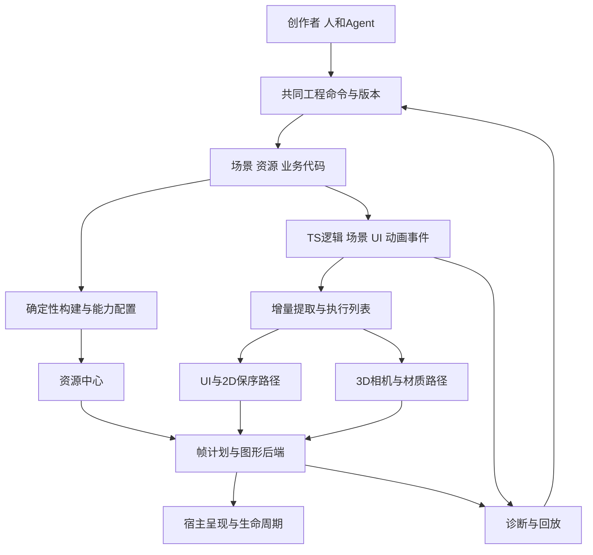

# 技术白皮书

[English](技术白皮书.en.md) | 简体中文

版本：0.7 候选稿 · 更新：2026年10月8日。本文细化新白鹭的技术取舍、合同与验证路径；具体选型仍待验证与决策。第三轮真实资产参考链17项适配检查及独立示例smoke通过，已有可运行研究代码，见[第三轮集成](第三轮集成记录.md)。第二轮64项CPU合同/布局/批次检查（事件13、资源25、UI18、批次8）及7项本地WebGL2检查，共71项，保留原范围与失败记录，知识库0.7.0只细化工程架构/API/代码候选规范，当时未新增或重跑程序；0.8.0已新增[自主核心首段](核心框架实现记录.md)的严格编译和headless验证，没有重跑旧研究程序。有限研究证据不代表新引擎、完整渲染原型、性能、真实宿主或旧工程迁移验收。

[产品需求](产品需求说明书.md) · [工程规划](工程规划.md) · [研究核查](第一轮研究核查.md) · [第一轮验证](技术验证记录.md) · [第一轮审计](第一轮审计.md) · [第二轮验证](第二轮验证记录.md) · [第二轮审计](第二轮审计.md)

## 设计目标与证据尺度

已确认目标是服务依靠 AI 制作游戏的新创作者，兼顾复杂 UI 的2D与轻量3D，把渲染运行时作为核心，同时正式交付旧工程一键 AI 迁移。历史效率、接口迁移和整合工具经验决定研究重点，今天的领先幅度仍需实测。具体需求以[需求登记册](../registry/需求.json)为准。

使用四层证据：需求记录确定项目目标；官方与静态资料说明机制及版本范围；独立程序验证其实际执行的合同；完整产品与真实设备对照才证明交付和性能。它们不能相互升级。H001–H008均保持`untested`，D001–D016均保持`proposed`，V002已有局部自主headless核心，完整渲染及正式验收尚未完成，V003–V006的产品实现仍为`not_started`。第二轮引用的Khronos页面按其`editorDraft`身份作为编辑草案参考，不能表述为最终批准标准；规范说明也不等于实现、性能或宿主验收。

第一轮26项架构模型与7项本地浏览器检查保留在原[技术验证记录](技术验证记录.md)，不被第二轮结果覆盖。第二轮各组当前证据及明确边界如下；71项是登记案例数，包含边界刻画与错误策略反例，不是产品验收项数，也不表示穷尽状态空间。

| 研究组与当前结果 | 实际覆盖 | 不能据此宣称 |
| --- | --- | --- |
| [事件13/13](../evidence/reliable-event-probe-results.json) | 内存outbox、连续消费水位、ACK身份、重发去重、背压与状态重置反例 | 持久交付、进程崩溃恢复、跨进程exactly-once或真实音频/网络桥接 |
| [资源25/25](../evidence/async-resource-probe-results.json) | 独立租约、解码/上传状态、任务与设备代次、迟到回调、显式fence及失败重试 | 真实解码、驱动上传/释放、线程安全、真实OOM或资源性能 |
| [嵌套UI18/18](../evidence/nested-ui-probe-results.json) | 有限垂直布局、尺寸依赖、结构编辑、矩形clip/命中与外部字形宽度fixture | 完整EUI、真实字体塑形/IME、任意约束布局或局部世界更新性能 |
| [独立批次8/8](../evidence/batch-state-probe-results.json) | 有序相邻分批，独立消费者读取texture/pipeline/clip及容量边界 | 任意遮罩、滤镜、完整材质或GPU性能优势 |
| [混合图形7/7](../evidence/mixed-scene-probe-results.json) | 本地桌面WebGL2程序几何、实际合批像素、透视cube、两段刚性几何、帧图集及固定帧恢复 | 真实角色/骨骼资产导入、完整动画、WebGPU场景后端、手机/小游戏/原生宿主或FPS/功耗优势 |

## 三种建设路径与候选主线

| 路径 | 收益 | 主要代价 | 本阶段判断 |
| --- | --- | --- | --- |
| TS创作与逻辑，按负载组织渲染，可选WASM/原生核 | 接近Web开发生态，便于AI操作工程；按需裁剪和局部替换 | 多后端及跨语言合同仍需维护，热点是否下沉需测量 | 保持候选原型主线，局部研究不构成最终批准 |
| 所有核心优先进入C++或Rust/WASM，再提供脚本接口 | 原生资源与计算策略可集中 | 初始化、模块体积、桥接、调试和宿主限制可能抵消计算收益 | 作为计算热点和原生路线的对照，暂不全部采用 |
| 整合成熟渲染内核，在其上构建白鹭创作与迁移层 | 能较快取得部分3D能力 | UI语义、包体、资源生命周期、平台和许可可能受底层约束 | Three renderer/glTF/动画仅为已执行参考链；白鹭自主核心独立实现，公共组件拟生产依赖另列归属与成本 |

候选主线是统一工程和资源语义，UI/2D与3D分别组织执行，共享必要设备、资源和调度；性能优化由实际瓶颈驱动。TS、WASM或WebGPU名称本身不产生优势。[Cocos历史JSB成本](https://docs.cocos.com/creator/3.8/manual/en/advanced-topics/jsb-optimizations.html)与[Emscripten互操作文档](https://emscripten.org/docs/porting/connecting_cpp_and_javascript/Interacting-with-code.html)支持认真设计传递与生命周期，不能由此推出跨引擎速度排名。

## 成熟实现作为工程起点

R012要求先理解社区成熟原理，R015要求白鹭核心独立编写并明确公共依赖归属。首条真实资产链采用Three成熟renderer、GLTFLoader与AnimationMixer，保留包体、状态交接、UI合成、生命周期和替换边界；Babylon与PlayCanvas提供机制和替换对照。Web普通文字采用成熟Canvas整行/整段测量绘制，高频数字及固定短标签采用受控图集；glTF/KTX2通用库可以明确依赖，基础轨道和骨骼原理无需重新发明；白鹭动画与资源核心依自有规格独立实现。

固定commit、具体函数、许可、已修复问题和白鹭适配边界见[开源参考实现与采用方案](开源参考实现与采用方案.md)。首条参考链已锁定Three r186并实际执行，17/17有限适配检查通过，详见[第三轮集成](第三轮集成记录.md)。历史r180源码研究与当前执行版本分别保留。跨宿主字体/IME、完整复杂UI与3D组合、目标包体和收益仍由产品及设备验收确认。

## 真实资产集成带来的边界修正

当前复用成熟glTF导入、骨架克隆、动画采样与renderer，白鹭适配共享CPU资源、独立实例pose、同context的UI状态交接和恢复。固定帧实际蒙皮画面与文字UI恢复后均非空且逐byte一致；这只覆盖一个2joint圆柱样本。图形可用、资源已上传、作品可交互须分别表示，不能用context restored代替作品验收。

恢复清理回归发现旧GPU分配监听仍持有旧句柄，适配在丢失时撤销GPU分配并保留共享CPU资源，恢复后交由成熟renderer重新上传。最后实例退出再结束CPU bundle所有权；两种生命周期不能共用一个“已销毁”标志。初始化失败和示例待启动期间退出也必须清理或拒绝迟到owner，详见[审计](第三轮审计.md)。

当前未裁剪的五JS模块与embedded资产共2,313,137 bytes；分文件gzip9合计461,988 bytes、Brotli11合计350,491 bytes仅为本地估算。首发2D profile应避免携带3D模块，3D路径须做目标构建裁剪，并按宿主测首包与首次交互；该参考链没有证明小包或快速加载优势。

## 工程、逻辑与执行状态

持久化工程包含源资源、场景、规则与业务代码；运行逻辑拥有游戏状态和事件；GPU/C++执行镜像可重建。工程对象的永久身份与运行句柄的slot/generation分开，防止销毁、复制和异步回调误定位。构建缓存由内容、工具与目标配置产生，可丢弃重建，不能成为唯一原件。

公共API保持清晰的场景、组件和UI表达，不强迫创作者理解底层内存布局。热点的紧凑数据、SoA、对象池及C++核都在API下面评估。旧语义通过独立、可裁剪适配与迁移规则承接；不强制每个新作品携带全部历史运行时。

## 渲染策略与帧计划

3D基线建议移动前向渲染，先覆盖unlit、PBR/toon、环境光、烘焙及有限实时光影，配合相机剔除、LOD和实例化。数量、规格与物理范围由标杆决定。Forward+、计算粒子及高级后处理按能力与内容启用，不作为所有宿主的必要条件。

UI和2D骨骼遵守显示、slot、透明与遮罩顺序；3D不透明列表可优化材质和深度顺序，透明列表另有正确性约束。屏幕UI默认保持清晰分辨率，可直接合成到最终目标；需要遮罩、滤镜或跨层组合时才申请离屏资源。世界空间UI、穿插2D/3D、色彩空间和混合约定须显式定义，不能由默认“3D后画UI”处理全部场景。

小型帧图描述pass依赖、资源读写、寿命和load/store，按场景功能与能力缓存计划；变化触发重建，避免逐帧解释通用大图。临时资源只在寿命不重叠、格式和使用兼容时复用。测量中间目标面积、带宽与过绘，不能把合并pass或减少DrawCall自动等同于省电。[Filament帧图](https://google.github.io/filament/notes/framegraph.html)提供机制参考；收益需白鹭实测。

第一轮与第二轮CPU/WebGL像素反例均显示：改变透明绘制顺序会改变结果。第二轮独立批次消费者实际读取批头的texture、pipeline与clip；混合图形实验在256×192目标中把6条UI命令合为3次实际draw，49,152像素对照的最大通道误差为1，落在预先规定的±3容差内。最终CPU参考逐像素、逐命令读取原始状态，不调用批次builder或executor；共用builder的早期报告另行保留，不能当作独立对照。故意忽略clip或混合模式也产生了实际GPU像素反例。这只支持已执行有限状态的保序和分批合同，不证明FPS、省电、完整遮罩、字体或骨骼正确性，见[第二轮验证](第二轮验证记录.md)与[第二轮审计](第二轮审计.md)。

## 复杂UI与文字

失效至少区分属性、测量、布局、变换、绘制、命中与资源变化。属性变化先标记依赖，尺寸自下向上求解，布局与坐标按影响自上向下更新；没有依赖变化时不重复计算。布局区域只有在外部尺寸、位置和依赖确实隔离时才可截断传播，不能给任意子树贴标签就停止祖先更新。

列表虚拟化与renderer复用保持业务对象身份、选择和事件绑定；复用的运行对象需防止旧回调写入。缓存键覆盖字体、语言、fallback、方向、样式、DPI、主题及裁剪等实际依赖。小字、CJK、emoji、输入法与动态文本采用各自质量策略，不预定一个SDF方案解决全部文字。Web默认TextProvider调用成熟Canvas测量与整串绘制；图集只用于适合的高复用标签。保留原文、字体内容及加载代次，预热并合并缺字；图集重建使旧UV/布局失效。Babylon的CPU脏区与全Canvas纹理上传分开计量。

矩形裁剪优先评估scissor，复杂遮罩比较stencil、alpha与离屏代价。子树位图缓存记录面积、失效率、内存与重建成本；动画、滚动与滤镜可能使缓存变贵。失效循环必须报出依赖与未稳定项，不能丢掉更新后报告成功。

第一轮固定区域模型的稀疏变化仍扫描区域内128个兄弟，全失效仍处理1024个对象，见原验证记录。第二轮补了嵌套尺寸依赖、重挂、隐藏/恢复、矩形裁剪与命中；任意子树隔离的反例会漏掉祖先尺寸与后续兄弟位置。8节点fixture的稀疏变化求值6个尺寸，对照全量16个，但事务仍复制并验证完整源树/依赖图，变更帧仍遍历全部节点求世界坐标、可见性与clip；静止帧仍复制快照记录。不能隐藏这些成本后声称整体增量或速度优势。

第二轮文字仅采用外部`glyphWidths`夹具，未加载真实字体或执行塑形、CJK、emoji、fallback与IME。最多128节点、标量输入不超过1e6、引用factor不超过8及最多4096项密集字形宽度是该实验的支持预算，用于原子拒绝越界/稀疏输入，不是产品上限或最终批准预算；小数误差、任意规模和深递归仍未证明。

## 动画、资源与构建

动画事件、状态机和玩法时钟与视觉采样分开。3D姿态与约束参考先保持正确，再评估GPU变形；2D骨骼必须保留附件、顺序、约束、变形和裁剪；序列帧优先更新图集和帧引用。降低视觉采样时仍处理应发生的事件、根运动及玩法所需变换。

资源中心候选合同分别管理源与下载数据、解码数据、GPU驻留及租约，并独立区分`resourceGeneration`、`leaseId`、`taskId`和`deviceEpoch`。同一owner的每次获取都产生独立租约，旧租约的use/release/cancel不能影响新租约；共享任务在其他有效租约存在时可继续，最后租约释放使未完成任务失效。CPU解码任务检查资源及任务身份，不携带设备代次；GPU上传另检查设备代次，CPU成功不能直接报告驻留，恢复设备也不能同步置为resident，必须重新提交上传。

最后释放后是否回收还取决于当前设备的未完成使用。fence必须显式携带帧号及提交/注册回调时捕获的`deviceEpoch`；省略epoch应拒绝，迟到回调不能读取当前epoch冒充新设备完成。第二轮已用手动交错回调验证这些身份、失败与重试合同，CPU数据仍是字符串夹具、fence仍是显式注入；它假设设备丢失使旧GPU使用失效，没有证明真实驱动释放时机或真实OOM。换图、缓存降级和内存预算仍需真实资产与设备验证。

构建按目标配置产生资源、模块/分包、shader变体与依赖清单。转码器下载、初始化、CPU和上传成本计入首个可玩体验；字体图标可有质量例外。Webshader仍可能客户端编译，异步pipeline只提供可等待的就绪与失败点，不能承诺零卡顿。[KTX2技术资料](https://registry.khronos.org/KTX/specs/2.0/ktxspec.v2.html)、[GPUDevice接口](https://gpuweb.github.io/types/interfaces/GPUDevice)仅提供版本范围内的机制参考。

## 后端、桥接与恢复

GPU合同建议共用资源描述、材质语义、状态和生命周期，具体WebGPU/WebGL2命令及shader路径允许差异。探测adapter后还需核对实际device的features/limits；WebGL1需求、shader语言生成方式和原生Dawn等提供者仍待宿主及成本试验。不能将现代API抽象强制压成最弱后端，也不能让增强路径成为独立工程体系。

桥接候选包包含协议版本、epoch、sequence、对象代际、资源就绪依赖及所有权。先完整检查包头、命令字段与身份一致性，再提交临时构造的状态；无效快照不得先修改epoch或序号。重复包不重复消费通知；代际不符不写入；图形状态的序号缺口停止增量并请求新epoch快照。缓冲交接和确认后才复用，队列有界，可覆盖状态才允许合并。

玩法事件由TS权威层维护，纯视觉状态与已消费图形通知可随执行镜像重建。确需跨界执行的音频、输入回执等事件采用独立eventID、未确认outbox、连续消费水位及身份绑定的ACK；发送不删除，合法累计ACK才删除，缺口等待重发且不跳跃消费，图形epoch不能重置事件状态。第二轮已实际执行内存副作用数组、丢交付/ACK、重发、乱序和背压案例；同一仍存活实例中，effects同步追加与水位同步更新，在公平重试及活跃消费者条件下支持有序、单次内存消费。

这不是crash-safe exactly-once：outbox、水位和副作用没有持久原子事务，状态重置反例实际产生第二次副作用。外部副作用异常、进程崩溃、会话重新绑定、真实网络/IPC/音频及WASM桥接仍未验证；有界性只覆盖未确认项和sent集合，不等于消费审计数组或总内存有界。容量不足明确拒绝，调用方仍须处理重试，永久丢包不能由该模型自动解决。

设备丢失暂停提交，失效旧GPU句柄，重新选择能力并重建资源和图形状态；不要重播已经消费的玩法事件。异步GPU完成检查资源、任务与设备身份及丢失状态，旧设备回调不得恢复驻留。后台恢复重置时钟基线并处理必要状态，不补跑无限积压。第二轮资源模型已拆开解码与上传回调，但仍非真实异步执行器；本地WebGL2混合实验确实经历contextlost/restored并重建合成资源，只对照同一固定帧像素，不证明玩法/动画事件恢复。没有实际C++/WASM跨界、网络桥接或WebGPU设备丢失恢复测试。

## 调度、持续性能与宿主

模拟、动画语义、视觉采样、解码、上传和呈现分别有预算。使用宿主提供的回调与时间，限制队列和每帧上传；worker、共享内存与热提示是增强能力，基线不依赖它们。第一轮安全的本地页面中，SharedArrayBuffer仍不可用，说明安全上下文与跨源隔离条件需分开记录。

持续质量控制使用滞回与明确质量档；先降低可选3D负载，保持UI清晰与玩法语义。输入延迟、P95/P99帧时间、内存、首次可交互、能耗和温升共同评估。浏览器提供的时间或温度代理注明局限，直接功耗测量及手机长期测试仍未执行。

宿主适配负责输入/IME、surface、文件、网络、音频、存储、SDK和前后台，图形后端负责渲染。浏览器、微信、抖音、Instant Games、Discord和Telegram分别建立客户端/设备/版本矩阵。第一批环境尚待确定，当前桌面API验证不决定首发支持范围。

## AI工程与旧工程迁移

人、Agent和可视化工具共用有版本的工程命令、引用校验、构建与诊断。修改有明确范围、差异、冲突前提、修复预算与撤销；LLM不进入逐帧引擎循环。开发期诊断可定位对象、pass、资源和业务代码，发行包可裁除诊断工具。

R008必须随核心接口讨论事件、坐标、布局、动画、资源与存储语义。先确定转换，再Agent修复，以完整旧新行为、视觉、状态、平台和性能对照验收。R008仍是完整一键迁移、继续编辑与真实发布的最终正式交付；导入或构建成功只是中间状态。V006依赖V001–V005，不能跳过V005工作台与真实发布闭环；无法取得旧基线时记录阻塞，不能臆造完美运行。

## 取舍与下一轮门槛

第二轮已经在有限模型和程序场景中部分执行事件、异步资源、嵌套UI、独立批次消费及实际混合渲染，不能再将这些笼统列为“尚未开始”。程序混合内容仅有12三角形透视cube、两段刚性骨节、Canvas英文纹理和3×1颜色帧图集；没有真实3D角色导入、完整2D骨骼/蒙皮约束/附件、真实字体质量或复杂动画事件。

首条真实资产链、有限Canvas文字、共享状态与恢复已运行。下一轮接入2D旧骨骼语义金样、完整3D角色与复杂UI，细化frame/资源/交互就绪阶段、字体提供者与目标构建裁剪；白鹭继续只补适配差异和独有合同。标杆、宿主与设备预算同步收敛，目标是完整2D骨骼/3D角色、解码上传、真实字体输入与混合UI；实际fence和设备性能另按可测环境验收。随后在真实手机/宿主测冷启动、输入与持续负载，并补持久事件与外部副作用边界、完整AI编辑和旧新迁移对照。仅在同内容同画质的完整测量与产品验收后，才判断H001–H008或接受、拒绝、替代D001–D016。

竞品的现代后端、2D重构、CLI与AI工具持续演进，[本轮核查](第一轮研究核查.md)保留其版本、机制与验证范围。白鹭聚焦复杂UI与轻量3D、稳定工程语义和实测闭环；未来两三年的可持续优势需要作品与回归不断验证。

## 后端 编译与原生 Runtime 候选补充

按[底层选型设计](图形后端编译与原生Runtime选型.md)以WebGPU资源模型组织新架构、持续维护WebGL兼容，Canvas只承担声明的离屏文字/有限2D。稳定TS7与快速预览/类型检查/资源/原生构建分离；Rust逐模块进入并保留C++依赖，图形库与VM独立。主线源码、正式release和实际宿主验收分别登记；Steam与GPUAI只保留扩展，不能替代首版复杂UI与迁移。

## 独立实现的工程边界

执行[独立实现与第三方依赖规范](独立实现与第三方依赖规范.md)：白鹭核心依据自有规格独立编写，参考研究记录机制、版本与适用边界。公共图形API、VM、编译器、字体和转码库保持第三方身份；Three参考链如实记录成熟renderer、导入和动画能力的使用，执行结果不证明白鹭自主内核。新模块提交来源记录、设计理由和同功能同画质对照，已有原理的独立实现不要求发明新算法；改进以白鹭目标和实际证据判断。

## 工程结构与公共代码合同

R016确认现代工程与白鹭风格要求。D016的[工程结构](工程技术架构与项目结构.md)、[API与命名](公共API设计与命名规范.md)、[代码规范与门禁](代码规范与质量门禁.md)细化包依赖、公共入口、Scope/租约、事件、原生边界、Agent事务与质量检查。名称与API均为候选；[首段自主核心](核心框架实现记录.md)已严格编译并验证headless子集与包边界，完整API、GPU/平台、CI及完整迁移尚未验收。
