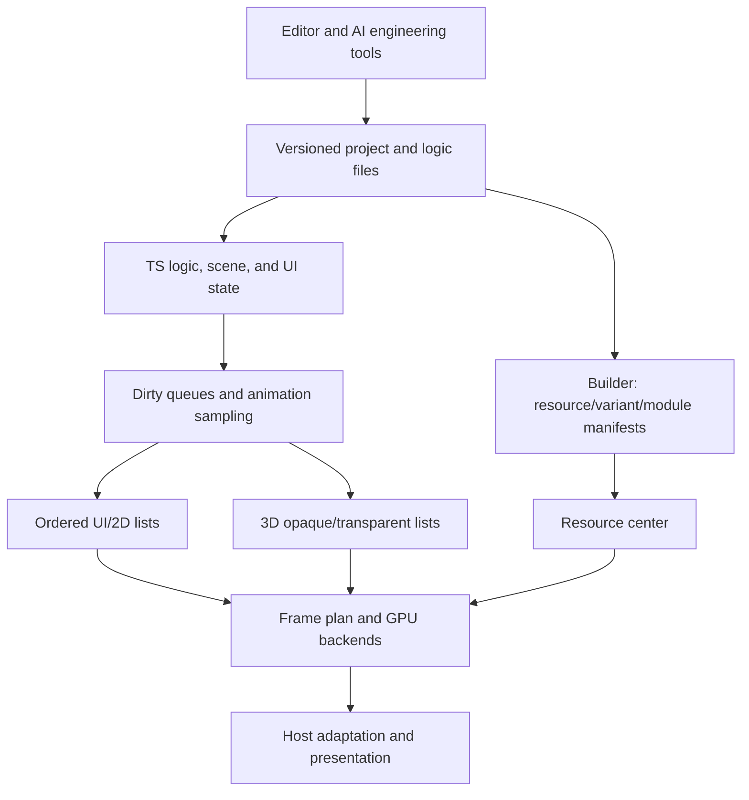

# Technical Architecture

English | [简体中文](../../Cns/docs/技术架构.md)

Updated: 2026-10-08, knowledge base 0.7.0. This is a candidate architecture. Independent contract models and local browser graphics research programs have run previously. The complete engine, production hosts, performance, and migration have not passed acceptance, and specific technical selections are not approved. D001–D016 are all proposed; H001–H008 are all untested. See the [requirements register](../../Cns/registry/需求.json) for confirmed requirements and the [decision register](../../Cns/registry/决策.json) for candidate tradeoffs.

[Knowledge base home](../README.md) · [Technical white paper](technical-white-paper.md) · [Product requirements document](product-requirements.md) · [Engineering plan](engineering-plan.md) · [Round-two verification record](../archive/round-2-research.md#execution) · [Round-two audit](../archive/round-2-research.md#audit) · [Historical round-one verification](../archive/round-1-research.md#execution) · [Round-one research review](../archive/round-1-research.md#research)

## Design starting point

For new creators who mainly use AI to make games, provide mixed creation with complex 2D UI and lightweight 3D (R002), put rendering and the runtime at the core (R003), and support scenes, characters, VFX, UI, 2D skeletal animation, and frame animation (R004). The content scale, target devices, and host scope for lightweight 3D remain undecided. Advantages in loading, frame time, memory, and power are objectives to verify (R005), not existing capabilities.

The candidate direction is “unify creation data and resource contracts, organize execution by workload, and share devices and frame scheduling.” An accessible TS scene/component API is separated from compact execution data. Avoid forcing complex UI into 3D objects and avoid developing two incompatible engines. See [product components](product-components.md) for the product boundary.

R011 requires progressive research, deliberation, verification, and self-audit of the design. In this round, V008 forms a 0.6 candidate package of the white paper, PRD, and engineering plan. The research portion of V001 is in_progress; V002 has a local headless core; product implementation for V003–V006 has not started. Contract models and local pixel experiments support only their actual execution boundaries. They do not yet cover complete UI, skeletal animation, mixed assets, actual JS/WASM/C++ bridges, or host/device matrices. The [round-two verification record](../archive/round-2-research.md#execution) is authoritative for model-audit defects and fix revalidation. Passing research programs does not establish the product architecture.

## Data authority and interface contracts

| Layer | Authority and constraints |
|---|---|
| Creation project | Project, scene, component, material, and animation schemas plus logic files are the persistence authority; saves carry versions, and stable object IDs support diffs, migration, and origin tracking. |
| Runtime state | The TS logic layer owns game state, scene changes, animation clocks, and events. Loading a project establishes initial state; temporary runtime state does not silently change the project in reverse. |
| Execution mirrors | C++/WASM/GPU hold only rebuildable projections. Layout, hit, and bounds queries should be calculated in their owning layer or returned asynchronously, avoiding bidirectional per-property synchronization. |
| Build artifacts | Content hashes, tool versions, target capability profiles, and dependency manifests determine derived resources. Caches are not authoritative and can be rebuilt if lost. |
| Host | Adapters provide surface, input/IME, clocks and presentation, audio, files/network/storage, lifecycle, and permissions. Capability detection and error classification must not masquerade as the complete browser API. |

Bridge packets must contain protocol versions, object IDs/generations, frame sequence numbers, resource readiness dependencies, and buffer ownership. Creation, updates, and destruction apply at defined frame boundaries. Old asynchronous callbacks after destruction are discarded by generation. Queues have capacity limits and backpressure; unbounded accumulation is prohibited. Overwritable state updates may be coalesced; event order must be retained. On protocol incompatibility, sequence gaps, or context loss, stop submission, rebuild mirrors from an acknowledged snapshot, and rebind resources. Recovery cannot simply ignore commands.

The resource center separately tracks download/decode artifacts, CPU data, and GPU handles, using explicit scene leases and dependency ownership. Unload first cancels tasks and removes references, then releases after GPU use completes. Asynchronous image replacement retains the old resource until the new one is ready. Loading failures need timeouts, bounded retries, placeholders, or explicit blocking. On OOM, first release rebuildable caches and reduce optional quality; if the budget still cannot be met, return a diagnosable error. Background recovery resets the clock baseline to avoid catching up an unbounded number of frames. Device loss can rebuild graphics state and should not resend consumed game events.

## AI tools and legacy-project constraints

R006's AI engineering tools work through versioned project commands, schemas, and development diagnostics, outside the per-frame rendering loop. Validate dependencies and capability requirements before changes, record origins and diffs, and generate previewable results. Failed transactions restore the original project. Natural-language suggestions cannot bypass project validation to become runtime authority directly.

R008 is already a formal requirement for the first complete release objective: [one-click AI migration of legacy projects](legacy-project-migration.md) must participate from core interface design onward. V006 ultimately depends on V001–V005. Display order, coordinates/anchors, events, timing, masks/filters, EUI, and animation semantics need mappings; compatibility modules are trimmed by dependency. Legacy projects become fixed visual, behavioral, resource, and platform regression samples. Report automatic conversion coverage and human intervention; “successful import” cannot replace “correct execution after migration.”

Static review of the historical Runtime observed binary command bridging, a native retained tree, adjacent-texture batching, and dirty caches. These can inform mechanisms, but do not prove current buildability, complete platform coverage, or leading performance. Historical networking code was also observed disabling certificate verification; security defaults must be rechecked and fixed before reusing network modules.

## Selection boundaries

TS public interfaces, optional Rust/C++ computation/execution modules, and WASM/native deployment are candidates. End-to-end bottlenecks determine whether to move work down. [Cocos's historical JSB optimization record](https://docs.cocos.com/creator/3.8/manual/en/advanced-topics/jsb-optimizations.html) explains that added bridging once offset native execution benefits; this does not mean its current version has inferior performance.

Competitors incur compatibility costs and also continue restructuring: [Cocos 3.8 pipeline migration](https://docs.cocos.com/creator/3.8/manual/zh/render-pipeline/overview.html), [LayaAir 3.3.0 rewrite record](https://github.com/layabox/LayaAir/releases/tag/v3.3.0), and [Godot 3→4 upgrade guide](https://docs.godotengine.org/en/4.7/tutorials/migrating/upgrading_to_godot_4.html). This round's official-source review supports several mechanisms and versions, while retaining source-date conflicts for Laya 3.3/3.4. IDE and old official-site dates were not rechecked; see the [round-one research review](../archive/round-1-research.md#research). Each engine's migration and restructuring records retain their specific version boundaries. Egret's efficiency objective is judged by results from continuously verified works; sustained advantage still needs version regression verification. Initial hosts, team, schedule, and numerical performance budgets are unconfirmed. See [rendering engine and runtime](rendering-engine-and-runtime.md), [core advantages and verification](core-advantages-and-verification.md), and the [delivery plan](delivery-plan.md) for next steps.

Round two partly verified independent event streams, per-lease asynchronous resources, nested layout/hit testing, and batch-shared state, and actually ran programmatically generated WebGL mixed scenes. These do not cover complete assets, text/skeletal semantics, or target-device budgets. The [technical white paper](technical-white-paper.md), [engineering plan](engineering-plan.md), and [round-two verification record](../archive/round-2-research.md#execution) define the current contract refinements and next gates.

## Executed mature-implementation baseline

R012 confirms the principle of prioritizing open-source implementations. Following the [adoption plan](open-source-reference-implementations-and-adoption.md), mature 3D renderer/glTF/animation, Canvas text, and compressed-texture paths advance a replaceable reference chain that unifies Egret frame, state, and resource interfaces; existing foundational algorithms are not researched from scratch again. The first r186 real-glTF reference chain has run and currently passes 17/17 checks. The [round-three integration](../archive/round-3-research.md#execution) and [audit](../archive/round-3-research.md#audit) record assets, shared ownership, text/graphics handoff, recovery, and error paths. Research code exists; complete complex UI/2D skeletal animation/characters, CJK/IME, hosts, and benefits have not passed acceptance. D/H/complete-product statuses have not been advanced beyond their evidence.

## Backend and native-selection additions in this round

[Graphics backends, compilation, and native Runtime selection](graphics-backends-and-native-runtime-selection.md) adds WebGPU/WebGL/Canvas responsibilities, the TS7 toolchain, Rust/C++, VMs and native graphics libraries, and future desktop and GPU AI extensions. It adds source research and candidate design only. These candidates have not been installed/run, and coverage beyond round three's 17 checks has not been added. D013–D015 remain proposed; H008 remains untested.

## Core implementation origins

Write the Egret core independently under R015 and the [independent implementation and third-party dependency rules](independent-implementation-and-dependency-policy.md). Standard mechanisms and mature source code inform understanding; public libraries retain explicit dependency identity. The earlier third-party reference chain remains research and does not count as an independent kernel.

## Engineering structure and public code contracts

R016 confirms modern engineering and Egret-style requirements. D016's [engineering structure](engineering-architecture-and-project-structure.md), [API and naming](public-api-design-and-naming.md), and [code standards and gates](code-standards-and-quality-gates.md) refine package dependencies, public entry points, Scope/leases, events, native boundaries, Agent transactions, and quality checks. Names and APIs are candidates. The [first independent core slice](core-framework-implementation-record.md) has been strictly compiled and has verified the headless subset and package boundaries. Complete APIs, GPU/platforms, CI, and complete migration have not passed acceptance.
